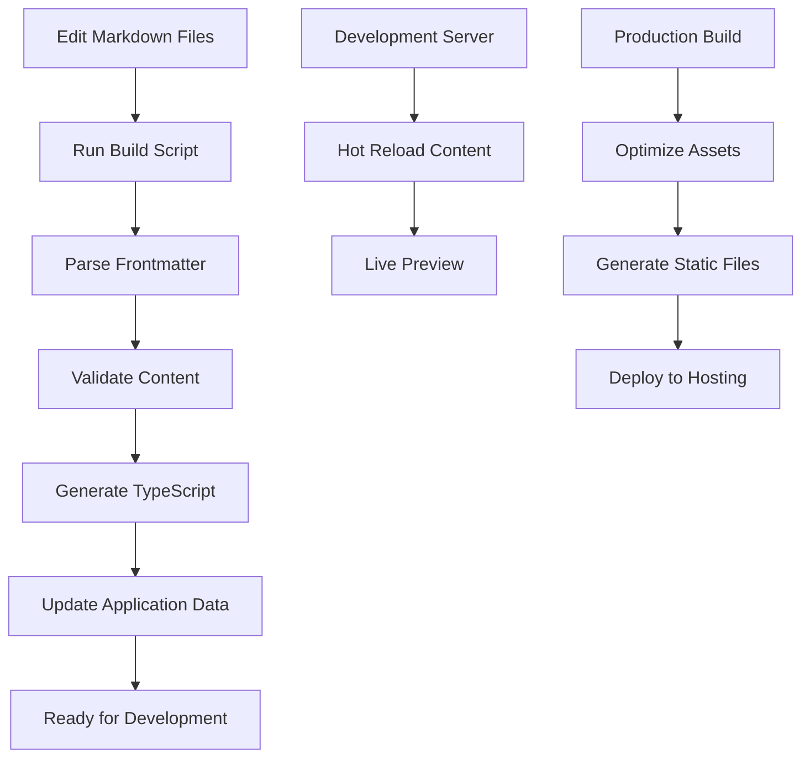

# Content Management System

This directory contains the markdown-based content structure for the CV Tutorial Website. The system provides a complete workflow for creating, managing, and deploying educational content.

## ✅ Implementation Status

**COMPLETED FEATURES:**
- ✅ Markdown-based content structure
- ✅ Frontmatter metadata parsing
- ✅ Content validation system
- ✅ Automated build process
- ✅ TypeScript generation
- ✅ Content rendering utilities
- ✅ Template system for new content
- ✅ Asset management structure

## Directory Structure

```
content/
├── modules/                    # Module definitions
│   ├── module-1-setup/        # Module 1: Setting Up for Success
│   │   ├── module.md          # Module metadata and description
│   │   └── lessons/           # Lessons for this module
│   │       ├── 01-digital-workshop.md
│   │       ├── 02-first-webpage.md
│   │       └── ...
│   ├── module-2-styling/      # Module 2: Styling with CSS
│   │   ├── module.md
│   │   └── lessons/
│   └── ...
├── assets/                    # Media assets
│   ├── images/               # Images for lessons
│   ├── videos/               # Video files
│   └── code-examples/        # Code example files
└── templates/                # Content templates
    ├── lesson-template.md    # Template for new lessons
    └── module-template.md    # Template for new modules
```

## Content Format

### Module Files (`module.md`)

Each module directory contains a `module.md` file with frontmatter metadata:

```yaml
---
id: 1
title: "Your First Lines of Code - Setting Up for Success"
slug: "setup-for-success"
description: "Learn the fundamentals of web development and set up your development environment."
estimatedTime: "2-3 hours"
complexity: "Beginner"
prerequisites: []
order: 1
---

# Module Content

Detailed module description and overview goes here...
```

### Lesson Files

Each lesson is a markdown file with frontmatter:

```yaml
---
title: "Welcome! Your Digital Workshop"
description: "Set up your development environment and get familiar with the tools."
estimatedTime: "30-45 minutes"
tools: ['Web Browser', 'VS Code']
complexity: "Beginner"
prerequisites: []
order: 1
---

# Lesson Content

Lesson content in markdown format...
```

## Content Types Supported

- **Text**: Regular markdown content
- **Code blocks**: Fenced code blocks with syntax highlighting
- **Images**: ``
- **Videos**: `📹 [Video Title](path/to/video.mp4)`
- **GIFs**: `🎬 [GIF Title](path/to/animation.gif)`
- **Callouts**: Content starting with 💡, ⚠️, or 📝

## Updating Content

1. Edit the markdown files directly
2. The build system will automatically parse and validate content
3. Content is hot-reloaded during development
4. Production builds include content validation

## Validation

All content is automatically validated for:
- Required frontmatter fields
- Content structure
- Asset references
- Accessibility requirements (alt text, etc.)
#
# Quick Start

### 1. Build Content from Markdown
```bash
# Build all content from markdown files
npm run build:content

# Build with verbose output
npm run build:content -- --verbose

# Validate content only (no build)
npm run validate:content
```

### 2. Create New Content

**New Module:**
```bash
# Copy the template
cp content/templates/module-template.md content/modules/module-X-name/module.md
# Edit the frontmatter and content
```

**New Lesson:**
```bash
# Copy the template
cp content/templates/lesson-template.md content/modules/module-X-name/lessons/01-lesson-name.md
# Edit the frontmatter and content
```

### 3. Development Workflow

1. **Edit Content**: Modify markdown files in `content/modules/`
2. **Build**: Run `npm run build:content` to generate TypeScript files
3. **Develop**: Run `npm run dev` to start development server
4. **Deploy**: Run `npm run build` for production build

## Content Management Features

### ✅ Implemented Features

#### 1. Markdown Parsing & Validation
- **Frontmatter Support**: YAML metadata in markdown files
- **Content Block Parsing**: Automatic conversion to structured data
- **Validation**: Comprehensive content structure validation
- **Error Reporting**: Clear error messages for content issues

#### 2. Content Types
- **Text**: Regular markdown with formatting support
- **Code Blocks**: Syntax-highlighted code examples
- **Images**: Responsive images with alt text and captions
- **Videos**: Embedded video content with controls
- **GIFs**: Animated demonstrations
- **Callouts**: Tips, warnings, and notes with icons

#### 3. Build System
- **Automated Processing**: Converts markdown to TypeScript
- **Hot Reloading**: Content updates during development
- **Production Optimization**: Optimized builds for deployment
- **Asset Management**: Handles images, videos, and other assets

#### 4. Template System
- **Module Templates**: Standardized module structure
- **Lesson Templates**: Consistent lesson format
- **Content Generation**: Utilities for creating new content

### 🔄 Content Workflow



## Usage Examples

### Creating a New Lesson

```yaml
---
title: "CSS Grid Fundamentals"
description: "Learn the basics of CSS Grid layout system"
estimatedTime: "45-60 minutes"
tools: ['VS Code', 'Web Browser', 'Chrome DevTools']
complexity: "Intermediate"
prerequisites: ['CSS Basics', 'HTML Structure']
order: 3
---

# CSS Grid Fundamentals

## Introduction
Learn how to create complex layouts with CSS Grid...

## Step-by-Step Instructions

### Step 1: Setting Up the Grid Container
```css
.container {
  display: grid;
  grid-template-columns: repeat(3, 1fr);
  gap: 20px;
}
```

💡 **Pro Tip**: Use `fr` units for flexible grid columns!


*Example of a 3-column CSS Grid layout*
```

### Content Rendering

The system automatically converts markdown to structured content blocks:

```typescript
// Generated content structure
{
  id: "text-1",
  type: "text",
  content: "Learn how to create complex layouts with CSS Grid..."
},
{
  id: "code-1", 
  type: "code",
  content: ".container {\n  display: grid;\n  ...\n}",
  metadata: { language: "css" }
},
{
  id: "callout-1",
  type: "callout", 
  content: "💡 **Pro Tip**: Use `fr` units for flexible grid columns!"
}
```

## Build Process Details

### 1. Content Discovery
- Scans `content/modules/` directory
- Finds all module directories and lesson files
- Loads markdown content with frontmatter

### 2. Parsing & Validation
- Parses YAML frontmatter for metadata
- Converts markdown to content blocks
- Validates required fields and structure
- Reports errors and warnings

### 3. Code Generation
- Generates `src/data/courseContent.ts`
- Creates JSON files for API consumption
- Updates application data structures
- Maintains type safety with TypeScript

### 4. Asset Processing
- Resolves asset paths
- Optimizes images (future feature)
- Handles video content
- Manages code examples

## Integration with Application

The content management system integrates seamlessly with the existing application:

```typescript
// Import generated content
import { COURSE_MODULES, getModuleById } from '../data/courseContent.js';

// Use in components
const module = getModuleById(1);
const lessons = module?.lessons || [];

// Render content blocks
import { ContentRenderer } from '../utils/contentRenderer.js';
const html = ContentRenderer.renderContentBlocks(lesson.content);
```

## Validation & Quality Assurance

### Content Validation Rules
- **Required Fields**: Title, description, estimated time, complexity
- **Slug Format**: URL-friendly slugs for modules and lessons
- **Order Consistency**: Sequential lesson and module ordering
- **Asset References**: Valid paths to images and videos
- **Accessibility**: Alt text for images, proper heading structure

### Error Reporting
```bash
❌ Content validation failed:
  - Module 1 missing title
  - Lesson "CSS Basics" has no content
  - Image missing alt text: hero-image.png
```

## Performance Considerations

- **Build-time Processing**: Content parsed during build, not runtime
- **Static Generation**: Pre-generated TypeScript files for fast loading
- **Lazy Loading**: Images and videos load on demand
- **Caching**: Content cached during development for fast rebuilds

## Future Enhancements

### Planned Features
- [ ] **Asset Optimization**: Automatic image compression and WebP generation
- [ ] **Search Integration**: Full-text search across all content
- [ ] **Internationalization**: Multi-language content support
- [ ] **Analytics Integration**: Track lesson completion and engagement
- [ ] **Content Versioning**: Git-based content history and rollbacks

### Advanced Features
- [ ] **Interactive Elements**: Embedded quizzes and exercises
- [ ] **Progress Tracking**: User progress across lessons
- [ ] **Content Recommendations**: Suggest related lessons
- [ ] **Collaborative Editing**: Multi-author content creation

## Troubleshooting

### Common Issues

**Build fails with "No modules found"**
- Check that `content/modules/` directory exists
- Ensure module directories contain `module.md` files
- Verify frontmatter format is correct

**Content not updating in development**
- Run `npm run build:content` to regenerate files
- Check for validation errors in console
- Restart development server if needed

**Images not displaying**
- Verify image paths in markdown files
- Check that images exist in `content/assets/images/`
- Ensure proper alt text is provided

### Getting Help

1. Check the console for validation errors
2. Review the generated `courseContent.ts` file
3. Test with the sample content provided
4. Refer to the template files for proper format